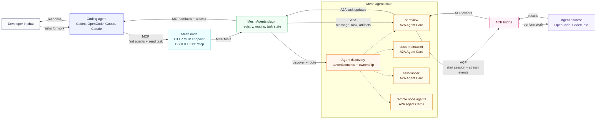

# Mesh Agents

Mesh Agents turns a [mesh-llm](https://github.com/Mesh-LLM/mesh-llm) network
into a shared cloud of useful [A2A](https://a2a-protocol.org/latest/specification/)
agents. Instead of every developer hand-wiring the same local helpers, people
can publish agents to the mesh, discover agents contributed by others, and run
them with the inference, tools, and runtime capacity available across the mesh.

Codex, OpenCode, Goose, Claude, and other MCP-capable clients get one local MCP
endpoint for finding agents, inspecting their native
[A2A Agent Cards](https://a2a-protocol.org/latest/specification/#8-agent-discovery-the-agent-card),
sending tasks, and reading artifacts. The agent might run on your node, another
node in a private team mesh, or eventually a public mesh. The client does not
need to know where the agent lives.

Agents are defined once for the mesh and surfaced through MCP. That makes them
easy to share, easy to reuse, and independent of any one coding client.

This README uses a pull request reviewer named `pr-review` as the running
example. It is a realistic coding agent: a developer asks for a GitHub PR
review, the coding client discovers `pr-review` through Mesh MCP, Mesh sends the
work to the A2A agent, and the agent uses an ACP harness to inspect code and
return findings.

## What It Is

Mesh Agents provides:

- a directory-backed A2A agent registry
- A2A Agent Card loading from native JSON
- MCP tools for listing agents, sending messages, reading tasks, and reading artifacts
- persistent A2A task state backed by SQLite
- an ACP bridge for local coding-agent harnesses such as OpenCode
- CLI tools for authoring and validating local agent definitions

The local foundation is implemented today. Mesh-wide discovery and remote
routing are the next layer.

## Architecture



The coding agent only needs one integration point: Mesh's MCP endpoint. Through
that endpoint it can discover available agents, inspect their A2A Agent Cards,
send work, and read the resulting task state or artifacts. This keeps Codex,
OpenCode, Goose, Claude, and similar clients out of the business of knowing how
agents are hosted or routed.

Mesh Agents runs inside the mesh node as the plugin that owns the agent control
plane. It loads local Agent Cards from `~/.mesh-llm/agents/`, advertises
available agents into the mesh, tracks which node owns each agent, and persists
A2A task state. If an agent is local, the task can run on the current node. If
the best agent is remote, Mesh routes the request to the owning node and returns
the same task/artifact shape to the caller.

A2A is the contract between Mesh and the agent. The Agent Card describes what
the agent can do, and A2A tasks carry the work, status updates, and artifacts.
For agents that need an interactive coding runtime, Mesh Agents bridges from
A2A into ACP. ACP is the harness-facing protocol: it starts a session, streams
work into OpenCode, Codex, or another compatible harness, and sends events back
to the A2A task. The result flows back to the coding agent as normal MCP tool
output.

## What It Is Used For

Use Mesh Agents when you want a mesh node to expose useful task-oriented agents
to AI clients.

Examples:

- a `pr-review` agent that reviews a GitHub pull request and returns prioritized findings
- a `docs-maintainer` agent that updates docs from a change summary
- a `release-notes` agent that turns merged PRs into release notes
- a `test-runner` agent that runs project-specific checks and summarizes failures

The caller talks to a local MCP tool. Mesh Agents owns the agent registry, task
state, and runtime bridge.

The rest of this README walks through `pr-review` as the example agent.

## Installation

Install the agents plugin through
[mesh-llm](https://github.com/Mesh-LLM/mesh-llm):

```bash
mesh-llm plugins install Mesh-LLM/agents
```

After installation, run the plugin's user-facing CLI through `mesh-llm`.

The normal MCP endpoint is hosted by the running mesh node. Launch a supported
client through mesh-llm and the client is wired to the mesh MCP endpoint,
including the Mesh Agents tools:

```bash
mesh-llm opencode
mesh-llm goose
mesh-llm pi
mesh-llm claude
```

Or register Mesh's MCP endpoint in any AI tool that can speak MCP over HTTP:

```bash
http://127.0.0.1:3131/mcp
```

## Defining Agents

Local agent definitions live under `~/.mesh-llm/agents/`. Each directory
describes one agent that Mesh can advertise, route to, and execute.

If you have not used A2A before, the key idea is that an agent has a public
contract and a private runtime. The public contract is the A2A Agent Card: it
answers "what is this agent, what can it do, and how do A2A clients talk to
it?" The private runtime config answers "how does this machine actually run
that agent?"

Create the `pr-review` local agent definition:

```bash
mesh-llm agents init pr-review --runtime opencode
```

That creates the files for the example pull request reviewer:

```text
~/.mesh-llm/
  agents/
    pr-review/
      agent-card.json
      runtime.toml
      instructions.md
```

### Agent Card

`agent-card.json` is the native
[A2A Agent Card](https://a2a-protocol.org/latest/specification/#8-agent-discovery-the-agent-card).
Think of it as the agent's business card. Mesh and MCP clients use it to decide
whether an agent is appropriate for a task before sending work.

A card describes:

- the agent name, description, and version
- the A2A interface Mesh exposes for that agent
- supported input and output modes
- whether streaming is supported
- the agent's skills, such as `pr-review` or `release-notes`

For the `pr-review` example, the starter card created by
`mesh-llm agents init` is valid JSON and can be edited directly:

```json
{
  "name": "Pr Review",
  "description": "Reviews pull requests and returns prioritized findings with file/line references.",
  "version": "0.1.0",
  "supportedInterfaces": [
    {
      "url": "http://127.0.0.1:3131/a2a/agents/pr-review",
      "protocolBinding": "JSONRPC",
      "protocolVersion": "1.0"
    }
  ],
  "capabilities": {
    "streaming": true
  },
  "defaultInputModes": ["text/plain"],
  "defaultOutputModes": ["text/markdown"],
  "skills": [
    {
      "id": "pr-review",
      "name": "Pull request review",
      "description": "Inspect a GitHub pull request and report correctness, regression, and test risks.",
      "tags": ["github", "code-review", "pull-request"]
    }
  ]
}
```

For mesh-local agents like `pr-review`, Mesh owns the served A2A URL. You
normally edit the name, description, modes, capabilities, and skills; Mesh
handles where the agent is actually reachable.

### Runtime Policy

`runtime.toml` is Mesh Agents' private execution policy. It is not part of A2A
and is not advertised as the agent's public contract. It tells the local mesh
node whether to expose the agent, which harness to use, how much concurrency is
allowed, and what workspace policy to apply when tasks run.

Example `runtime.toml` for `pr-review`:

```toml
enabled = true
visibility = "private"

[runtime]
type = "opencode"
max_concurrent_tasks = 1

[runtime.workspace]
mode = "temp_per_task"
keep = "on_failure"

[instructions]
file = "instructions.md"
delivery = "first_prompt"

[tools.mesh]
enabled = true

[policy]
advertise_on_mesh = false
public_mesh = false
```

Important fields:

- `enabled`: controls whether Mesh loads the agent.
- `visibility`: starts as `private`; use this to keep local agents off public surfaces.
- `runtime.type`: selects the harness bridge. `opencode` runs through OpenCode
  ACP defaults, `acp` lets you provide an explicit ACP command, and `remote`
  describes an externally hosted A2A agent.
- `runtime.max_concurrent_tasks`: caps simultaneous work for this agent. The
  default is `1`, which is safest for coding agents that mutate workspaces.
- `runtime.workspace.mode`: controls where work runs. `temp_per_task` creates a
  fresh temporary workspace per task; path-based workspace modes can pin an
  agent to a specific checkout.
- `runtime.workspace.keep`: controls cleanup. `on_failure` keeps failed task
  workspaces for debugging.
- `instructions.file`: points at the local instruction file delivered to the
  harness.
- `instructions.delivery`: `first_prompt` prepends the instructions to the
  first task prompt sent into the harness.
- `tools.mesh.enabled`: allows the harnessed agent to receive Mesh's own MCP
  tools.
- `policy.advertise_on_mesh`: controls whether this node gossips the agent to
  other mesh nodes.
- `policy.public_mesh`: protects against accidentally advertising private local
  agents on a public mesh.

### Instructions

`instructions.md` is the agent's operating brief. For `pr-review`, this is
where you say what to prioritize, how to format findings, which checks to run,
and what not to do. Mesh Agents sends those instructions into the ACP harness
according to `runtime.toml`.

Useful authoring commands:

```bash
mesh-llm agents list
mesh-llm agents init <agent-id> --runtime opencode
mesh-llm agents validate [agent-id]
mesh-llm agents show <agent-id>
mesh-llm agents enable <agent-id>
mesh-llm agents disable <agent-id>
```

`mesh-llm agents init` is the starter authoring tool for local Agent Cards. For
`pr-review`, it creates a valid card skeleton, runtime policy, and instructions
file. Edit `agent-card.json` against the official A2A Agent Card docs, then run
`mesh-llm agents validate pr-review`.

## Discovering Agents

Clients discover agents through MCP. In normal use, the MCP endpoint is
`http://127.0.0.1:3131/mcp`. Register that URL in any AI tool that can speak
MCP over HTTP, or use client launchers such as `mesh-llm opencode`,
`mesh-llm goose`, `mesh-llm pi`, and `mesh-llm claude` to configure it for you.

The MCP server exposes these tools:

| Tool | Purpose | Example |
|---|---|---|
| `get_agents` | List available agents. | "What mesh agents are available?" |
| `get_agent` | Read one agent's native Agent Card and runtime summary. | "Show me what the `pr-review` agent can do." |
| `send_message` | Send a message to an agent through A2A. | "Ask `pr-review` to review Mesh-LLM/mesh-llm#708." |
| `get_task` | Fetch persisted task state. | "Check whether the PR review task has finished." |
| `view_text_artifact` | Read text parts from a task artifact. | "Open the review findings artifact." |
| `view_data_artifact` | Read a structured task artifact. | "Show the structured findings returned by the agent." |

When running as a mesh-llm plugin, these tools are surfaced through mesh-llm's
hosted MCP endpoint alongside the other mesh-provided tools.

## Using Agents

Use agents by asking your AI tool to find an agent and delegate the work. The
client uses Mesh's MCP tools behind the scenes.

Example prompts using the `pr-review` agent:

```text
Find an available mesh agent that can review GitHub pull requests, then use it
to review Mesh-LLM/mesh-llm#708. Return only actionable findings with file and
line references.
```

```text
Use the pr-review mesh agent to review the current branch. Prioritize
correctness, regressions, and missing tests. Include the task artifact when it
finishes.
```

```text
Show me the Agent Card for pr-review before you use it. Confirm it is the right
agent for a GitHub pull request review, then send it Mesh-LLM/mesh-llm#708.
```

```text
Check whether the pr-review task has completed and summarize the returned
findings artifact.
```

```text
Use pr-review to review this branch, but only report correctness issues,
security risks, regressions, and missing tests.
```

The same pattern works for other agents such as `docs-maintainer`,
`release-notes`, or `test-runner`. The client sees a normal local MCP tool
flow. Mesh Agents handles A2A task state, runtime execution, and artifact
persistence.

## Developing

Build the CLI:

```bash
cargo build -p mesh-agents
```

Run checks:

```bash
cargo fmt --all -- --check
cargo clippy --workspace --all-targets --locked -- -D warnings
cargo test --workspace --locked
cargo build --workspace --locked
```

The live OpenCode ACP tests are ignored by default because they require an
installed and configured OpenCode ACP agent.

### Adding Runtime Support

Runtime support is deliberately split between the public agent definition and
the private harness bridge.

Most new coding runtimes should be integrated through ACP. If the runtime can
serve an ACP-compatible stdio process, users can already configure it with the
generic runtime:

```toml
[runtime]
type = "acp"
command = "my-agent-harness"
args = ["acp"]
max_concurrent_tasks = 1
```

Add a named runtime when Mesh should provide first-class defaults, for example
`runtime.type = "my_harness"` without requiring every user to remember the
command and ACP arguments. The usual code path is:

1. Add a `RuntimeKind` variant in `crates/mesh-agents-a2a/src/registry.rs`.
2. Add the matching `AgentRuntimeArg` value in `crates/mesh-agents-cli/src/main.rs`.
3. Teach `crates/mesh-agents-cli/src/agents.rs` how `mesh-llm agents init --runtime <name>` writes the starter `runtime.toml`.
4. Add command resolution in `crates/mesh-agents-acp-bridge/src/lib.rs`, usually by mapping the new runtime to an ACP stdio command and default args.
5. Add tests for default command selection, explicit `runtime.command` override behavior, and generated agent config.

Runtimes that are already full remote A2A services should not go through ACP.
Use `runtime.type = "remote"` and let Mesh route to the external A2A endpoint
described by the Agent Card.

Workspace layout:

```text
crates/mesh-agents-a2a/
  A2A Agent Card loading, local registry, local service, and SQLite task store.

crates/mesh-agents-acp-bridge/
  ACP harness bridge, OpenCode command expansion, workspace setup, and task execution.

crates/mesh-agents-cli/
  User-facing CLI and MCP stdio server.
```

## Releasing

Releases are built by GitHub Actions. Push a version tag:

```bash
git tag v0.1.0
git push origin v0.1.0
```

Or run the `Release` workflow manually with a `v*` version. The workflow builds
and uploads:

- `agents-x86_64-unknown-linux-gnu.tar.gz`
- `agents-aarch64-apple-darwin.tar.gz`
- `agents-x86_64-pc-windows-msvc.zip`

Each archive is rooted under `agents/` and includes `plugin.toml`, the native
`agents` executable, `README.md`, and `LICENSE`.
