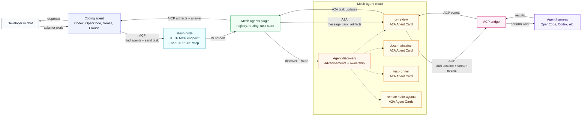

# Mesh Agents

Mesh Agents lets a [mesh-llm](https://github.com/Mesh-LLM/mesh-llm) node host
and advertise useful [A2A](https://a2a-protocol.org/latest/specification/)
agents. A mesh node is not itself an agent, and the whole mesh is not one giant
agent. Instead, any node can publish one or more Agent Cards for agents it is
willing to run.

That makes the mesh a shared agent cloud. Instead of every developer
hand-wiring the same local helpers, people can contribute agents to a private
team mesh, discover agents contributed by others, and run them with the
inference, tools, and runtime capacity available across the mesh.

Codex, OpenCode, Goose, Claude, and other MCP-capable clients get one local MCP
endpoint for finding agents, inspecting their native
[A2A Agent Cards](https://a2a-protocol.org/latest/specification/#8-agent-discovery-the-agent-card),
sending tasks, and reading artifacts. The agent might run on your node, another
node in a private team mesh, or eventually a public mesh. The client does not
need to know where the agent lives.

Agents are defined once on the node that owns them and surfaced through Mesh's
MCP endpoint. That makes them easy to share, easy to reuse, and independent of
any one coding client.

This README uses a pull request reviewer named `pr-review` as the running
example. It is a realistic coding agent: a developer asks for a GitHub PR
review, the coding client discovers `pr-review` through Mesh MCP, Mesh sends the
work to the A2A agent, and the agent uses an ACP harness to inspect code and
return findings.

## What It Is

Mesh Agents provides:

- a directory-backed A2A agent registry
- A2A Agent Card loading from native JSON
- MCP tools for listing agents, sending messages, reading tasks, and reading artifacts
- persistent A2A task state backed by SQLite
- an ACP bridge for local coding-agent harnesses such as OpenCode
- CLI tools for authoring and validating local agent definitions
- packaged Agent Skills for using and authoring Mesh agents from AI clients

The local foundation is implemented today. Mesh-wide discovery and remote
routing are the next layer.

## FAQ

### Is every mesh node an A2A agent?

No. A mesh node can host zero, one, or many A2A agents. The node runs the Mesh
Agents plugin, and the plugin advertises whichever local agent definitions are
enabled by policy.

### Is the whole mesh exposed as one A2A agent?

No. The mesh is the discovery and routing fabric. Individual agents are exposed
through their own A2A Agent Cards. Your client talks to the local Mesh MCP
endpoint, Mesh finds the right agent, and A2A carries the task to that agent.

### What does "defined once and surfaced through MCP" mean?

You define an agent once under `~/.mesh-llm/agents/<agent-id>/` on the node
that should run it. MCP-capable clients such as Codex, OpenCode, Goose, Claude,
and Pi connect to Mesh's local MCP endpoint instead of each maintaining their
own copy of the agent configuration.

### Can I keep an agent private?

Yes. Local agent definitions start private. `visibility = "private"` keeps the
agent off public surfaces, `policy.advertise_on_mesh = false` prevents gossip
to other nodes, and `policy.public_mesh = false` protects against accidental
publication on a public mesh. Publish agents only when you intentionally want
other mesh peers to discover and use them.

### What if the agent has secret MCP connections?

Keep that agent private unless you intentionally want other mesh peers to send
it work. Secrets and private tool credentials stay on the node that owns the
agent, but a published agent runs with that node's configured tools. Treat
publishing as permission for other allowed peers to ask that agent to perform
work.

### How do MCP, A2A, and ACP fit together?

- MCP is how the coding client talks to Mesh.
- A2A is how Mesh describes and sends tasks to agents.
- ACP is how a local A2A agent drives a coding harness such as OpenCode, Codex,
  Goose, or Pi.

## Architecture



The coding agent only needs one integration point: Mesh's MCP endpoint. Through
that endpoint it can discover available agents, inspect their A2A Agent Cards,
send work, and read the resulting task state or artifacts. This keeps Codex,
OpenCode, Goose, Claude, and similar clients out of the business of knowing how
agents are hosted or routed.

Mesh Agents runs inside the mesh node as the plugin that owns the agent control
plane. It loads local Agent Cards from `~/.mesh-llm/agents/`, advertises
available agents into the mesh, tracks which node owns each agent, and persists
A2A task state. If an agent is local, the task can run on the current node. If
the best agent is remote, Mesh routes the request to the owning node and returns
the same task/artifact shape to the caller.

A2A is the contract between Mesh and the agent. The Agent Card describes what
the agent can do, and A2A tasks carry the work, status updates, and artifacts.
For agents that need an interactive coding runtime, Mesh Agents bridges from
A2A into ACP. ACP is the harness-facing protocol: it starts a session, streams
work into OpenCode, Codex, or another compatible harness, and sends events back
to the A2A task. The result flows back to the coding agent as normal MCP tool
output.

## What It Is Used For

Use Mesh Agents when you want a mesh node to expose useful task-oriented agents
to AI clients.

Examples:

- a `pr-review` agent that reviews a GitHub pull request and returns prioritized findings
- a `docs-maintainer` agent that updates docs from a change summary
- a `release-notes` agent that turns merged PRs into release notes
- a `test-runner` agent that runs project-specific checks and summarizes failures

The caller talks to a local MCP tool. Mesh Agents owns the agent registry, task
state, and runtime bridge.

The rest of this README walks through `pr-review` as the example agent.

## Installation

Install the agents plugin through
[mesh-llm](https://github.com/Mesh-LLM/mesh-llm):

```bash
mesh-llm plugins install Mesh-LLM/agents
```

After installation, run the plugin's user-facing CLI through `mesh-llm`.

Released plugin archives include Agent Skills under `skills/`. Install the
plugin skills into detected AI clients:

```bash
mesh-llm skills install
```

Agent launch commands such as `mesh-llm goose`, `mesh-llm pi`,
`mesh-llm opencode`, and `mesh-llm claude` also install available plugin skills
for that agent before starting the session.

The normal MCP endpoint is hosted by the running mesh node. Launch a supported
client through mesh-llm and the client is wired to the mesh MCP endpoint,
including the Mesh Agents tools:

```bash
mesh-llm opencode
mesh-llm goose
mesh-llm pi
mesh-llm claude
```

Or register Mesh's MCP endpoint in any AI tool that can speak MCP over HTTP:

```bash
http://127.0.0.1:3131/mcp
```

## Defining Agents

Local agent definitions live under `~/.mesh-llm/agents/`. Each directory
describes one agent that Mesh can advertise, route to, and execute.

If you have not used A2A before, the key idea is that an agent has a public
contract and a private runtime. The public contract is the A2A Agent Card: it
answers "what is this agent, what can it do, and how do A2A clients talk to
it?" The private runtime config answers "how does this machine actually run
that agent?"

Create the `pr-review` local agent definition:

```bash
mesh-llm agents init pr-review --runtime opencode
```

That creates the files for the example pull request reviewer:

```text
~/.mesh-llm/
  agents/
    pr-review/
      agent-card.json
      runtime.toml
      instructions.md
```

This repository also includes a ready-to-use demo definition under
`examples/pr-review/`. During plugin development, copy that directory into your
local agent registry and validate it:

```bash
mkdir -p ~/.mesh-llm/agents
cp -R examples/pr-review ~/.mesh-llm/agents/pr-review
mesh-llm agents validate pr-review
```

The generated files and the example files use the same shape. `agents init` is
the quickest way to start a new local agent; `examples/pr-review` is the richer
demo version used throughout this README.

### Agent Card

`agent-card.json` is the native
[A2A Agent Card](https://a2a-protocol.org/latest/specification/#8-agent-discovery-the-agent-card).
Think of it as the agent's business card. Mesh and MCP clients use it to decide
whether an agent is appropriate for a task before sending work.

A card describes:

- the agent name, description, and version
- the A2A interface Mesh exposes for that agent
- supported input and output modes
- whether streaming is supported
- the agent's skills, such as `pr-review` or `release-notes`

For the `pr-review` example, the starter card created by
`mesh-llm agents init` is valid JSON and can be edited directly:

```json
{
  "name": "Pr Review",
  "description": "Reviews pull requests and returns prioritized findings with file/line references.",
  "version": "0.1.0",
  "supportedInterfaces": [
    {
      "url": "http://127.0.0.1:3131/a2a/agents/pr-review",
      "protocolBinding": "JSONRPC",
      "protocolVersion": "1.0"
    }
  ],
  "capabilities": {
    "streaming": true
  },
  "defaultInputModes": ["text/plain"],
  "defaultOutputModes": ["text/markdown"],
  "skills": [
    {
      "id": "pr-review",
      "name": "Pull request review",
      "description": "Inspect a GitHub pull request and report correctness, regression, and test risks.",
      "tags": ["github", "code-review", "pull-request"]
    }
  ]
}
```

For mesh-local agents like `pr-review`, Mesh owns the served A2A URL. You
normally edit the name, description, modes, capabilities, and skills; Mesh
handles where the agent is actually reachable.

### Runtime Policy

`runtime.toml` is Mesh Agents' private execution policy. It is not part of A2A
and is not advertised as the agent's public contract. It tells the local mesh
node whether to expose the agent, which harness to use, how much concurrency is
allowed, and what workspace policy to apply when tasks run.

Example `runtime.toml` for `pr-review`:

```toml
enabled = true
visibility = "private"

[runtime]
type = "opencode"
max_concurrent_tasks = 1

[runtime.workspace]
mode = "temp_per_task"
keep = "on_failure"

[instructions]
file = "instructions.md"
delivery = "first_prompt"

[tools.mesh]
enabled = true

[policy]
advertise_on_mesh = false
public_mesh = false
```

Important fields:

- `enabled`: controls whether Mesh loads the agent.
- `visibility`: starts as `private`; use this to keep local agents off public surfaces.
- `runtime.type`: selects how the agent runs. `opencode`, `goose`, and `pi`
  are named ACP presets. `acp` lets you provide an explicit ACP command.
  `remote` describes an externally hosted A2A agent.
- `runtime.max_concurrent_tasks`: caps simultaneous work for this agent. The
  default is `1`, which is safest for coding agents that mutate workspaces.
- `runtime.workspace.mode`: controls where work runs. `temp_per_task` creates a
  fresh temporary workspace per task; path-based workspace modes can pin an
  agent to a specific checkout.
- `runtime.workspace.keep`: controls cleanup. `on_failure` keeps failed task
  workspaces for debugging.
- `instructions.file`: points at the local instruction file delivered to the
  harness.
- `instructions.delivery`: `first_prompt` prepends the instructions to the
  first task prompt sent into the harness.
- `tools.mesh.enabled`: allows the harnessed agent to receive Mesh's own MCP
  tools.
- `policy.advertise_on_mesh`: controls whether this node gossips the agent to
  other mesh nodes.
- `policy.public_mesh`: protects against accidentally advertising private local
  agents on a public mesh.

Named runtimes are just convenience presets over ACP. Use `type = "acp"` when
you want full control over the command line:

```toml
[runtime]
type = "acp"
command = "$HOME/bin/my-agent-harness"
args = [
  "acp",
  "--cwd", "{{ task.workspace }}",
  "--mcp", "{{ mesh.mcp_url }}",
  "--agent", "{{ agent.id }}",
  "--instructions", "{{ instructions.file }}"
]
max_concurrent_tasks = 1

[runtime.env]
MESH_LLM_MCP_URL = "{{ mesh.mcp_url }}"
MESH_AGENT_ID = "{{ agent.id }}"
TASK_ARTIFACTS_DIR = "{{ task.artifacts_dir }}"
```

Substitutions are expanded when a task starts, because task-specific values do
not exist until then. Expansion applies to `runtime.command`, every
`runtime.args` item, and `runtime.env` values.

Mesh template variables use `{{ ... }}`. Environment variables use `$HOME`,
`${HOME}`, or `{{ env.HOME }}`. Missing variables are configuration errors.

Useful substitutions:

| Variable | Example value | Meaning |
|---|---|---|
| `{{ agent.id }}` | `pr-review` | Agent directory id. |
| `{{ agent.name }}` | `Pr Review` | Human-readable Agent Card name. |
| `{{ agent.dir }}` | `/Users/alice/.mesh-llm/agents/pr-review` | Agent definition directory. |
| `{{ agent.card_path }}` | `/Users/alice/.mesh-llm/agents/pr-review/agent-card.json` | Native A2A Agent Card path. |
| `{{ agent.runtime_path }}` | `/Users/alice/.mesh-llm/agents/pr-review/runtime.toml` | Local runtime policy path. |
| `{{ task.id }}` | `task-01J8R2` | A2A task id. |
| `{{ task.workspace }}` | `/var/folders/.../mesh-a2a-pr-review-task-01J8R2` | Workspace assigned to this task. |
| `{{ task.prompt_path }}` | `/Users/alice/.mesh-llm/a2a/agents/pr-review/runtime/task-01J8R2/prompt.txt` | File containing the task prompt. |
| `{{ task.artifacts_dir }}` | `/Users/alice/.mesh-llm/a2a/agents/pr-review/runtime/task-01J8R2/artifacts` | Directory for harness-written outputs. |
| `{{ task.logs_dir }}` | `/Users/alice/.mesh-llm/a2a/agents/pr-review/runtime/task-01J8R2/logs` | Directory for harness logs. |
| `{{ instructions.file }}` | `/Users/alice/.mesh-llm/agents/pr-review/instructions.md` | Resolved instruction file path. |
| `{{ instructions.dir }}` | `/Users/alice/.mesh-llm/agents/pr-review` | Directory containing the instruction file. |
| `{{ mesh.mcp_url }}` | `http://127.0.0.1:3131/mcp` | Mesh-hosted MCP endpoint. |
| `{{ mesh.api_url }}` | `http://127.0.0.1:3131` | Mesh node API and console base URL. |
| `{{ mesh.openai_url }}` | `http://127.0.0.1:9337/v1` | Mesh OpenAI-compatible inference endpoint. |
| `{{ mesh.model }}` | `auto` | Runtime model value, or `auto` if unset. |
| `{{ mesh.data_dir }}` | `/Users/alice/.mesh-llm` | Mesh data directory. |
| `{{ env.HOME }}` | `/Users/alice` | Explicit environment lookup. |
| `$HOME`, `${HOME}` | `/Users/alice` | Shell-style environment expansion. |

For example, this config:

```toml
[runtime]
type = "acp"
command = "opencode"
args = [
  "acp",
  "--cwd", "{{ task.workspace }}",
  "--mcp", "{{ mesh.mcp_url }}",
  "--instructions", "{{ instructions.file }}"
]
```

might start the harness like this for a `pr-review` task:

```bash
opencode acp \
  --cwd /var/folders/.../mesh-a2a-pr-review-task-01J8R2 \
  --mcp http://127.0.0.1:3131/mcp \
  --instructions /Users/alice/.mesh-llm/agents/pr-review/instructions.md
```

### Instructions

`instructions.md` is the agent's operating brief. For `pr-review`, this is
where you say what to prioritize, how to format findings, which checks to run,
and what not to do. Mesh Agents sends those instructions into the ACP harness
according to `runtime.toml`.

Useful authoring commands:

```bash
mesh-llm agents list
mesh-llm agents init <agent-id> --runtime opencode
mesh-llm agents validate [agent-id]
mesh-llm agents show <agent-id>
mesh-llm agents enable <agent-id>
mesh-llm agents disable <agent-id>
```

`mesh-llm agents init` is the starter authoring tool for local Agent Cards. For
`pr-review`, it creates a valid card skeleton, runtime policy, and instructions
file. Edit `agent-card.json` against the official A2A Agent Card docs, then run
`mesh-llm agents validate pr-review`.

## Discovering Agents

Clients discover agents through MCP. In normal use, the MCP endpoint is
`http://127.0.0.1:3131/mcp`. Register that URL in any AI tool that can speak
MCP over HTTP, or use client launchers such as `mesh-llm opencode`,
`mesh-llm goose`, `mesh-llm pi`, and `mesh-llm claude` to configure it for you.

The MCP server exposes these tools:

| Tool | Purpose | Example |
|---|---|---|
| `get_agents` | List available agents. | "What mesh agents are available?" |
| `get_agent` | Read one agent's native Agent Card and runtime summary. | "Show me what the `pr-review` agent can do." |
| `send_message` | Send a message to an agent through A2A. | "Ask `pr-review` to review Mesh-LLM/mesh-llm#708." |
| `get_task` | Fetch persisted task state. | "Check whether the PR review task has finished." |
| `view_text_artifact` | Read text parts from a task artifact. | "Open the review findings artifact." |
| `view_data_artifact` | Read a structured task artifact. | "Show the structured findings returned by the agent." |

When running as a mesh-llm plugin, these tools are surfaced through mesh-llm's
hosted MCP endpoint alongside the other mesh-provided tools.

## Using Agents

Use agents by asking for the work you want done. You should not have to know
that agents exist, name an agent, or ask for discovery first. The client uses
Mesh's MCP tools behind the scenes to find the right A2A Agent Card, delegate
the task, poll task state, and read artifacts.

Example prompts using the `pr-review` agent:

```text
Code review Mesh-LLM/mesh-llm#708.
```

```text
Review the current branch for correctness regressions and missing tests.
```

```text
Review this PR and return only actionable findings with file and line
references: https://github.com/Mesh-LLM/mesh-llm/pull/708
```

```text
Show me the findings artifact from that review.
```

```text
Check whether the previous pull request review task has completed.
```

The same pattern works for other agents such as `docs-maintainer`,
`release-notes`, or `test-runner`. The client sees a normal local MCP tool
flow. Mesh Agents handles A2A task state, runtime execution, and artifact
persistence.

## Developing

Build the CLI:

```bash
cargo build -p mesh-agents
```

Run checks:

```bash
cargo fmt --all -- --check
cargo clippy --workspace --all-targets --locked -- -D warnings
cargo test --workspace --locked
cargo build --workspace --locked
```

The live OpenCode ACP tests are ignored by default because they require an
installed and configured OpenCode ACP agent.

### Adding Runtime Support

Runtime support is deliberately split between the public Agent Card and the
private harness bridge. A2A remains the public contract. ACP is how Mesh starts
local coding harnesses.

Most new coding runtimes should start with the generic ACP runtime. If the
runtime can serve an ACP-compatible stdio process, users can configure it
without a Mesh code change:

```toml
[runtime]
type = "acp"
command = "my-agent-harness"
args = [
  "acp",
  "--cwd", "{{ task.workspace }}",
  "--mcp", "{{ mesh.mcp_url }}"
]
max_concurrent_tasks = 1
```

Add a named runtime only when Mesh should provide a first-class preset, for
example `runtime.type = "my_harness"` instead of asking every user to remember
the command and ACP arguments. Named runtimes such as `opencode`, `goose`, and
`pi` should still resolve to ACP command templates. The usual code path is:

1. Add a `RuntimeKind` variant in `crates/mesh-agents-a2a/src/registry.rs`.
2. Add the matching `AgentRuntimeArg` value in `crates/mesh-agents-cli/src/main.rs`.
3. Teach `crates/mesh-agents-cli/src/agents.rs` how `mesh-llm agents init --runtime <name>` writes the starter `runtime.toml`.
4. Add command resolution in `crates/mesh-agents-acp-bridge/src/lib.rs`, mapping the new runtime to an ACP stdio command and default args.
5. Make sure the preset still runs through the same substitution path as `type = "acp"`.
6. Add tests for default command selection, explicit `runtime.command` override behavior, substitutions, and generated agent config.

Runtimes that are already full remote A2A services should not go through ACP.
Use `runtime.type = "remote"` and let Mesh route to the external A2A endpoint
described by the Agent Card.

Workspace layout:

```text
crates/mesh-agents-a2a/
  A2A Agent Card loading, local registry, local service, and SQLite task store.

crates/mesh-agents-acp-bridge/
  ACP harness bridge, OpenCode command expansion, workspace setup, and task execution.

crates/mesh-agents-cli/
  User-facing CLI and MCP stdio server.

skills/
  Agent Skills installed by mesh-llm for clients such as Goose, Pi, OpenCode,
  Claude, and Codex.
```

## Releasing

Releases are built by GitHub Actions. Push a version tag:

```bash
git tag v0.1.0
git push origin v0.1.0
```

Or run the `Release` workflow manually with a `v*` version. The workflow builds
and uploads:

- `agents-x86_64-unknown-linux-gnu.tar.gz`
- `agents-aarch64-apple-darwin.tar.gz`
- `agents-x86_64-pc-windows-msvc.zip`

Each archive is rooted under `agents/` and includes `plugin.toml`, the native
`agents` executable, packaged `skills/`, `README.md`, and `LICENSE`.
